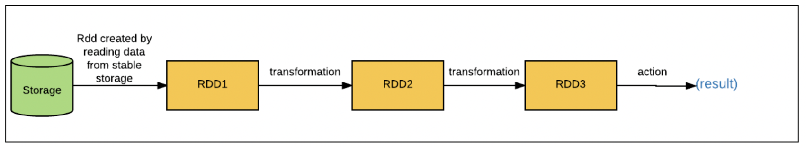

# PySpark README

Spark modes of deployment:

* local mode: single machine. Use for testing, debugging and demonstrating.
* cluster mode: set of pre-defined machines. Used in production.

No change in code when transitioning from one to the other.

A Spark shell is an interactive environment for running Spark jobs. It is useful for fast prototyping and allows interacting with data on disk or in memory.

The PySpark shell is a Python-based command line tool that allows to interact with Spark data structures and supports connecting to a cluster.

`SparkContext` is an entry point to interact with Spark. An entry point is a connection to the Spark cluster. In the PySpark shell there is a defaul object named `sc` that contains the `SparkContext`. Importing attributes of the `SparkContext`:

* Version: `sc.version`
* Python version: `sc.pythonVer`
* Master: URL of the cluster or string of local path to run in local mode of `SparkContext`.

When running a PySpark shell, we don't need to create any `SparkContext` object because PySpark automatically creates the `SparkContext` object named `sc`.

## Programming in PySpark's RDD's

RDD stands for Resilient Distributed Datasets.

* Resilient: withstands faliure.
* Distributed: spanning across multiple machines.
* Dataset: collection of partitioned data.

RDDs can be created from parallelizing an existing collection of objects, from external datasets (HDFS, S3, txt file...) or from exisiting RDDs.

* `sc.parallelize(, minPartitions=XX)`
* `sc.textFile(, minPartitions=XX)`
* `getNumPartitions()`

## Operations to RDDs: Transformations and Actions

* Transformations create new RDDs
* Actions perform computations on RDDs

RDD transformations follow Lazy evaluation

Basic RDD transformations are: `map()`, `filter()`, `flatMap()`, `union()`.

Basic RDD actions are: `collect()`, `take(N)`, `first()`, `count()`.

## PySpark SQL

PySpark SQL is a Spark libary for structured data. PySpark DataFrames are an inmutable distributed collection of data with named columns. DataFrames in Spark support both SQL type queries (`SELECT * from table`) or expression methods (`df.select()`).

`SparkSession` is the single point of entry to interact with Spark DataFrames, and is used to create and register DataFrames and execute SQL queries. It is available in the Spark shell as `spark`.

Schema controls de data and helps the DataFrames to optimize queries. Provides information on column names, type of data, presence of empty values...

DataFrame transformations include:

* `select()`, `filter()`, `groupby()`, `orderby()`, `dropDuplicates()`, `withColumnRenamed()`

actions include:

* `printSchema()`, `head()`, `show()`, `count()`, `columns`, `describe()`

### Interacting with Spark DataFrames using SQL queries

SQL queries are concise, easy to understand, and portable.

To use `sql()` we first need to creat a temporary table with `createOrReplaceTempView()`, and then we can apply SQL queries to it.

### Data Viz with PySpark

* `Pyspark_dist_explore`: `hist()`, `distplot()`, `pandas_histogram()`
* `toPandas()`: to create a pandas DataFrame and then use `matplotlib` or `seaborn` to plot.
* `HandySpark`:  easy to fetch data or compute statistics for columns, and returns pandas objects. allows to plot data while retaining the distributed computation. `toHandy()`.

## PySpark's MLlib

Collaborative filtering:

* user-user collaborative filtering: find users that are similar to target user.
* item-item collaborative filtering: finds and recommends items that are similar to target user items.

### Resources

* [PySpark cheat sheet](https://www.datacamp.com/cheat-sheet/pyspark-cheat-sheet-spark-in-python)
* [Paired RDDs](https://data-flair.training/blogs/spark-paired-rdd/)